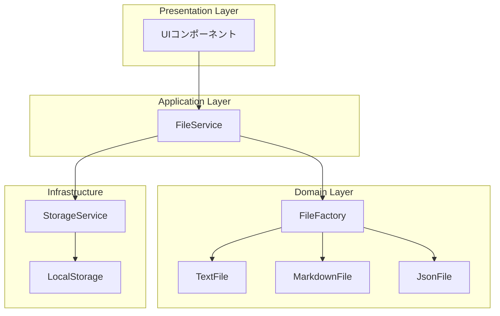
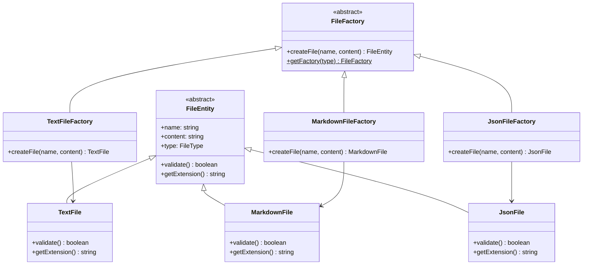

# 作りながら学ぶデザインパターン - Factory Pattern編

## 第4章: Factory Pattern でファイル操作を実装する

### この章で学ぶこと
- Factory Patternの基本概念と実装方法
- オブジェクト生成の抽象化によるメリット
- 拡張性を考慮した設計手法
- TypeScriptでの型安全なFactory実装

---

## Factory Patternとは何か？

Factory Pattern（ファクトリーパターン）は、**オブジェクト生成のロジックを抽象化**し、クライアントコードから具体的なクラスのインスタンス化を隠蔽するデザインパターンです。

### 問題：なぜFactory Patternが必要なのか？

テキストエディタで複数のファイル形式（.txt、.md、.json）を扱う場合を考えてみましょう。

#### ❌ Factory Patternを使わない場合

```typescript
// クライアントコードが具体的なクラスに依存
function createFile(type: string, name: string, content: string) {
  if (type === 'txt') {
    return new TextFile(name, content)
  } else if (type === 'md') {
    return new MarkdownFile(name, content)
  } else if (type === 'json') {
    return new JsonFile(name, content)
  }
  throw new Error('Unknown file type')
}
```

**問題点：**
1. 新しいファイル形式を追加するたびにif文を修正が必要
2. クライアントコードが具体的なクラスに強く依存
3. コードの変更箇所が分散して保守性が低下

#### ✅ Factory Patternを使った場合

```typescript
// 抽象ファクトリー
abstract class FileFactory {
  abstract createFile(name: string, content: string): FileEntity
}

// クライアントコードは抽象に依存
function createFile(factory: FileFactory, name: string, content: string) {
  return factory.createFile(name, content)
}
```

**メリット：**
1. 新しいファイル形式の追加が容易
2. クライアントコードは抽象に依存（疎結合）
3. 単一責任の原則に従った設計

---

## 実装ステップ

### Step 1: 型定義とインターフェース設計

まず、ファイル操作に必要な型定義から始めます。

#### 1.1 ファイル型定義の実装

Factory Patternを実装する前に、扱うデータの構造を明確に定義することが重要です。

```typescript
// src/domain/file/types/FileTypes.ts

/**
 * サポートするファイル形式の列挙型
 * Factory Patternにおいて、どの具象ファクトリーを使用するかを
 * 決定する際のキーとして使用される
 */
export type FileType = 'txt' | 'md' | 'json'

/**
 * ファイルのメタデータ情報
 * 全てのファイルエンティティが持つ共通のメタデータ
 */
export interface FileMetadata {
  readonly name: string
  readonly type: FileType
  readonly createdAt: Date
  readonly updatedAt: Date
  readonly size: number
  readonly id: string
}
```

**設計のポイント：**

1. **型安全性**: `FileType`をリテラル型で定義し、コンパイル時にサポートされていない形式をチェック
2. **不変性**: `readonly`修飾子を使用してデータの不正変更を防止
3. **拡張性**: 新しいファイル形式を追加する際は`FileType`に追加するだけ

#### 1.2 Factory Pattern設計における型の役割

```typescript
/**
 * ファイル作成時のオプション
 * Factory Patternでファイルを作成する際の設定オプション
 */
export interface FileCreationOptions {
  name?: string
  content?: string
  encoding?: string
  metadata?: Partial<FileMetadata>
}
```

この型定義により、Factory Patternの実装で以下のメリットが得られます：

1. **統一されたインターフェース**: 全てのファクトリーが同じオプション形式を使用
2. **オプショナルパラメータ**: 必要な情報のみを指定可能
3. **型補完**: IDEでの開発効率向上

#### 1.3 ファイルエンティティ基底クラスの実装

Factory Patternにおける「Product」の抽象クラスを実装しました。これは全ての具象ファイルエンティティが継承する基底クラスです。

```typescript
// src/domain/file/entities/FileEntity.ts

export abstract class FileEntity {
  protected metadata: FileMetadata
  protected content: FileContent

  constructor(options: FileCreationOptions) {
    // 共通の初期化処理
  }

  // 抽象メソッド（具象クラスで実装必須）
  protected abstract getFileType(): FileType
  protected abstract validateContent(content: string): FileValidationResult
  public abstract getExtension(): string
  public abstract getPreview(maxLength?: number): string

  // 共通メソッド
  public updateContent(newContent: string): FileValidationResult { /* ... */ }
  public validate(): FileValidationResult { /* ... */ }
}
```

**Template Method Patternの活用：**

1. **共通処理の基底クラス実装**: ファイル操作の共通ロジックを基底クラスで実装
2. **抽象メソッドでの特殊化**: ファイル形式固有の処理を抽象メソッドで定義
3. **拡張性の確保**: 新しいファイル形式追加時も共通機能を再利用

**設計の特徴：**

```typescript
// バリデーション機能の統合
public updateContent(newContent: string): FileValidationResult {
  // 1. 形式固有のバリデーション（抽象メソッド）
  const validationResult = this.validateContent(newContent)
  
  if (!validationResult.isValid) {
    return validationResult
  }

  // 2. 共通のサイズチェック
  if (newContent.length > FILE_CONSTANTS.MAX_FILE_SIZE) {
    return { isValid: false, errors: [FILE_ERROR_MESSAGES.FILE_TOO_LARGE], warnings: [] }
  }

  // 3. 内容とメタデータの更新
  this.content = { ...this.content, content: newContent, isDirty: true }
  this.metadata = { ...this.metadata, size: newContent.length, updatedAt: new Date() }

  return validationResult
}
```

### Step 2: 抽象ファクトリーの実装

Factory Patternの核となる抽象クラスを実装します。

#### 1.4 具象ファイルエンティティの実装完了

3種類のファイルエンティティを実装しました：

1. **TextFile**: プレーンテキストファイル
2. **MarkdownFile**: Markdown記法ファイル
3. **JsonFile**: JSON形式ファイル

**各エンティティの特徴：**

```typescript
// TextFile - シンプルなテキスト処理
export class TextFile extends FileEntity {
  protected validateContent(content: string): FileValidationResult {
    // 制御文字チェック、長い行の警告など最小限のバリデーション
  }
  
  public getWordCount(): number { /* 単語数カウント */ }
  public getStatistics() { /* テキスト統計 */ }
}

// MarkdownFile - Markdown記法のバリデーション
export class MarkdownFile extends FileEntity {
  protected validateContent(content: string): FileValidationResult {
    // 見出し記法、リンク、画像の妥当性チェック
  }
  
  public getHeadings() { /* 見出し一覧 */ }
  public generateTableOfContents() { /* 目次生成 */ }
}

// JsonFile - 厳密なJSON構文チェック
export class JsonFile extends FileEntity {
  protected validateContent(content: string): FileValidationResult {
    // JSON.parseによる構文チェック、構造分析
  }
  
  public formatJson() { /* JSON整形 */ }
  public getValueAtPath(path: string) { /* パス指定での値取得 */ }
}
```

**Template Method Patternの効果：**

各ファイル形式で共通処理（メタデータ管理、基本バリデーション）を継承し、固有処理（形式特有のバリデーション、プレビュー生成）を個別実装することで、コードの再利用性と拡張性を両立しています。

### Step 2: Factory Patternの実装

いよいよFactory Patternの核心部分を実装しました。

#### 2.1 抽象ファクトリーの設計

```typescript
// src/domain/file/factories/FileFactory.ts

export abstract class FileFactory {
  // Factory Method Pattern - 抽象メソッド
  protected abstract createFileEntity(options: FileCreationOptions): FileEntity
  public abstract getSupportedFileType(): FileType

  // Template Method Pattern - 共通処理
  public createFile(options: FileCreationOptions = {}): FileOperationResult {
    // 1. 作成前のバリデーション
    const validationResult = this.validateCreationOptions(options)
    if (!validationResult.success) return validationResult

    // 2. ファイルエンティティの作成（抽象メソッド）
    const fileEntity = this.createFileEntity(options)

    // 3. 作成後のバリデーション
    const fileValidation = fileEntity.validate()
    if (!fileValidation.isValid) {
      return { success: false, error: fileValidation.errors.join(', '), ... }
    }

    return { success: true, file: fileEntity.getMetadata(), ... }
  }
}
```

**設計のポイント:**

1. **Factory Method Pattern**: `createFileEntity()`を抽象メソッドとして定義
2. **Template Method Pattern**: `createFile()`で作成フローを統一
3. **共通バリデーション**: ファイル名チェックなどを基底クラスで実装

#### 2.2 具象ファクトリーの実装

```typescript
// テキストファイル用（シンプル）
export class TextFileFactory extends FileFactory {
  protected createFileEntity(options: FileCreationOptions): FileEntity {
    return new TextFile(options)
  }
}

// Markdownファイル用（テンプレート付き）
export class MarkdownFileFactory extends FileFactory {
  protected createFileEntity(options: FileCreationOptions): FileEntity {
    const defaultContent = options.content || this.getMarkdownTemplate()
    return new MarkdownFile({ ...options, content: defaultContent })
  }
  
  private getMarkdownTemplate(): string {
    return `# 新しいドキュメント\n\n## 概要\n\n...`
  }
}

// JSONファイル用（自動整形）
export class JsonFileFactory extends FileFactory {
  protected createFileEntity(options: FileCreationOptions): FileEntity {
    let content = options.content || JSON.stringify(this.getJsonTemplate(), null, 2)
    // JSON整形処理
    return new JsonFile({ ...options, content })
  }
}
```

#### 2.3 ファクトリーマネージャー（Abstract Factory + Registry）

```typescript
export class FileFactoryManager {
  private static instance: FileFactoryManager  // Singleton
  private factories: Map<FileType, FileFactory> = new Map()

  // ファクトリーの統一管理
  public createFile(fileType: FileType, options: FileCreationOptions): FileOperationResult {
    const factory = this.getFactory(fileType)
    return factory.createFile(options)
  }

  // 動的なファクトリー登録
  public registerFactory(factory: FileFactory): void {
    this.factories.set(factory.getSupportedFileType(), factory)
  }
}
```

**設計パターンの組み合わせ:**

1. **Factory Method**: 各ファクトリーでの生成メソッド
2. **Abstract Factory**: ファミリー単位でのファクトリー管理
3. **Singleton**: ファクトリーマネージャーの単一インスタンス
4. **Registry**: 動的なファクトリー登録システム
5. **Template Method**: 共通作成フローの実装

#### 2.4 使用例

```typescript
// 基本的な使用方法
const manager = FileFactoryManager.getInstance()

// 1. シンプルなファイル作成
const result = manager.createFile('txt', {
  name: 'sample.txt',
  content: 'Hello, World!'
})

// 2. テンプレート付きMarkdown作成
const mdResult = manager.createFile('md', {
  name: 'document.md'
  // contentを省略すると自動でテンプレートが設定される
})

// 3. 便利関数の使用
const quickResult = FileFactoryUtils.createSimpleFile('json', 'data.json')
```

### Step 3: アプリケーション層の統合

Factory PatternとRepository Patternを統合して、完全なファイル管理機能を実装しました。

#### 3.1 ストレージサービス（Repository Pattern）

```typescript
// src/application/services/StorageService.ts

export class StorageService {
  private readonly STORAGE_KEY = 'text-editor-files'
  
  // ファイルの永続化
  public async save(metadata: FileMetadata, content: string): Promise<FileOperationResult>
  
  // ファイルの読み込み
  public async load(fileId: string): Promise<FileOperationResult & { content?: string }>
  
  // ファイル検索
  public async search(criteria: FileSearchCriteria): Promise<FileMetadata[]>
  
  // ストレージ統計
  public async getStatistics(): Promise<StorageStatistics>
}
```

**Repository Patternの特徴:**

1. **データアクセスの抽象化**: LocalStorageの詳細を隠蔽
2. **統一インターフェース**: CRUD操作の一元化
3. **検索・フィルタ機能**: 高度なクエリ機能
4. **キャッシュ機能**: メタデータキャッシュによる高速化

#### 3.2 ファイルサービス（Facade Pattern）

```typescript
// src/application/services/FileService.ts

export class FileService {
  private fileFactory: FileFactoryManager
  private storageService: StorageService
  
  // Factory + Repository の統合
  public async createFile(fileType: FileType, options: FileCreationOptions) {
    // 1. Factory Patternでファイル作成
    const factoryResult = this.fileFactory.createFile(fileType, options)
    
    // 2. エンティティの再構築
    const fileEntity = await this.reconstructFileEntity(factoryResult.file, content)
    
    // 3. Repository Patternで永続化
    const saveResult = await this.storageService.save(metadata, content)
    
    return { ...saveResult, fileEntity }
  }
}
```

**アーキテクチャの統合効果:**



#### 3.3 Observer Patternとの統合

```typescript
// ファイル操作の通知システム
export interface FileOperationObserver {
  onFileOperation(notification: FileOperationNotification): void
}

// FileServiceでの通知実装
private notifyObservers(notification: FileOperationNotification): void {
  this.observers.forEach(observer => observer.onFileOperation(notification))
}
```

**複数パターンの協調:**

1. **Factory Pattern**: ファイル作成の責務
2. **Repository Pattern**: データ永続化の責務
3. **Facade Pattern**: 複雑性の隠蔽
4. **Observer Pattern**: 状態変更の通知

### Step 4: UIコンポーネントの実装

ここまでで、ドメイン層とアプリケーション層のFactory Pattern実装が完了しました。次にReactコンポーネントを実装して、ユーザーインターフェースを完成させます。

#### 4.1 FileMenu.tsx - ファイル操作メニュー

Factory Patternを活用したファイル作成・保存メニューを実装しました。このコンポーネントでは：

1. **Factory Pattern統合**: ファイル形式別の作成機能
2. **Observer Pattern**: ファイル操作の状態監視
3. **Command Pattern**: キーボードショートカット

```typescript
// 基本的な使用例
<FileMenu
  currentContent={editorContent}
  currentFileName={currentFile?.name}
  onFileCreated={handleFileCreated}
  onFileLoaded={handleFileLoaded}
  onFileSaved={handleFileSaved}
/>
```

**主な機能:**
- 3つのファイル形式（txt, md, json）の作成
- 既存ファイルの保存・上書き
- キーボードショートカット（Ctrl+S, Ctrl+N）
- リアルタイム操作フィードバック

#### 4.2 FileExplorer.tsx - ファイル一覧表示コンポーネント

Repository PatternとObserver Patternを統合したファイル管理UIを実装しました。

**設計パターンの活用:**

```typescript
// Observer Patternでリアルタイム更新
useEffect(() => {
  const observer: FileOperationObserver = {
    onFileOperation: (notification: FileOperationNotification) => {
      if (notification.success && (
        notification.operation === 'create' ||
        notification.operation === 'delete' ||
        notification.operation === 'update'
      )) {
        loadFiles() // ファイル一覧を自動更新
      }
    }
  }
  
  fileService.addObserver(observer)
  return () => fileService.removeObserver(observer)
}, [fileService])
```

**Strategy Patternによる表示モード切り替え:**

```typescript
// 表示モード設定の抽象化
const displayModeConfigs: Record<'list' | 'grid', DisplayModeConfig> = {
  list: { 
    icon: '📋', 
    label: 'リスト表示', 
    className: 'space-y-2' 
  },
  grid: { 
    icon: '🔲', 
    label: 'グリッド表示', 
    className: 'grid grid-cols-2 md:grid-cols-3 lg:grid-cols-4 gap-3' 
  }
}
```

**主な機能:**

1. **ファイル一覧表示**: Repository Patternでデータ取得
2. **リアルタイム更新**: Observer Patternで自動同期
3. **表示モード切り替え**: Strategy Patternでリスト・グリッド表示
4. **高度なフィルタリング**: ファイル形式、名前、日付、サイズによる絞り込み
5. **ソート機能**: 複数基準での並び替え
6. **ファイル操作**: 開く、削除機能
7. **ユーザビリティ**: 削除確認、操作フィードバック

**Repository Pattern統合の効果:**

```typescript
// Repository Patternによる抽象化されたデータアクセス
const loadFiles = useCallback(async () => {
  const fileList = await fileService.getFilePreviewList(maxFiles)
  setFiles(fileList)
}, [fileService, maxFiles])

// ファイル削除のFacade Pattern使用
const handleFileDelete = useCallback(async (file: FilePreview) => {
  const result = await fileService.deleteFile(file.metadata.id)
  if (result.success) {
    onFileDelete?.(file.metadata.id, file.metadata.name)
  }
}, [fileService, onFileDelete])
```

**パフォーマンス最適化:**

1. **useMemo**: フィルタリング・ソート結果のメモ化
2. **useCallback**: イベントハンドラーの最適化
3. **メタデータキャッシュ**: Repository層でのキャッシュ活用
4. **遅延読み込み**: ファイル内容は選択時のみ読み込み

#### UI層でのデザインパターン統合の学習ポイント

**1. 複数パターンの協調**
- Factory Pattern（ファイル作成）
- Repository Pattern（データアクセス）
- Observer Pattern（状態同期）
- Strategy Pattern（表示モード）
- Command Pattern（操作抽象化）

**2. React固有の考慮事項**
```typescript
// Custom Hookでの状態管理抽象化
export const useFileExplorer = () => {
  const [selectedFile, setSelectedFile] = useState(/* ... */)
  
  const handleFileSelect = useCallback(/* ... */)
  const handleFileDelete = useCallback(/* ... */)
  
  return {
    selectedFile,
    handleFileSelect,
    handleFileDelete,
    clearSelection
  }
}
```

**3. TypeScriptとの型安全性**
```typescript
interface FileExplorerProps {
  onFileSelect?: (fileId: string, fileName: string, content: string) => void
  onFileDelete?: (fileId: string, fileName: string) => void
  displayMode?: 'list' | 'grid'
  maxFiles?: number
}
```

このように、プレゼンテーション層でも下位層のデザインパターンを活用し、一貫性のあるアーキテクチャを実現しています。

#### 4.3 SaveDialog.tsx - 保存ダイアログコンポーネント

ファイル保存の詳細設定を行うダイアログコンポーネントを実装しました。このコンポーネントでは複数のデザインパターンを統合して、柔軟で使いやすい保存インターフェースを提供します。

**Strategy Patternによる保存モード管理:**

```typescript
// 保存モード設定の抽象化
const saveModeConfigs: Record<SaveMode, SaveModeConfig> = {
  create: {
    label: '新規作成',
    description: '新しいファイルとして保存',
    icon: '📄',
    buttonText: '新規保存',
    buttonVariant: 'default'
  },
  overwrite: {
    label: '上書き保存',
    description: '既存のファイルを上書き',
    icon: '💾',
    buttonText: '上書き保存',
    buttonVariant: 'default'
  },
  saveAs: {
    label: '名前を付けて保存',
    description: '新しい名前で保存',
    icon: '📝',
    buttonText: '別名保存',
    buttonVariant: 'outline'
  }
}
```

**自動モード判定ロジック:**

```typescript
// 保存モードの自動判定
useEffect(() => {
  const existingFile = existingFiles.find(file => file.name === fileName)
  
  if (currentFile && existingFile && existingFile.id === currentFile.id) {
    setSaveMode('overwrite')  // 同じファイルの編集
  } else if (existingFile) {
    setSaveMode('saveAs')     // 同名ファイルが存在
  } else {
    setSaveMode('create')     // 新規作成
  }
}, [fileName, existingFiles, currentFile])
```

**Command Patternによる保存操作の抽象化:**

```typescript
// 保存モード別の実行戦略
const handleSave = useCallback(async () => {
  let result
  
  switch (saveMode) {
    case 'create':
    case 'saveAs':
      // Factory Patternで新規作成
      result = await fileService.createFile(fileType, options)
      break

    case 'overwrite':
      // Repository Patternで更新
      result = await fileService.updateFileContent(currentFile.id, content)
      
      // ファイル名変更の場合はリネーム実行
      if (finalFileName !== currentFile.name) {
        await fileService.renameFile(currentFile.id, finalFileName)
      }
      break
  }
}, [saveMode, fileType, currentFile, content])
```

**主な機能と特徴:**

1. **インテリジェントなモード判定**: ファイル名や既存ファイルに基づく自動判定
2. **包括的なバリデーション**: ファイル名、拡張子、重複チェック
3. **ファイル形式選択**: Factory Patternと統合したタイプ選択
4. **リアルタイムプレビュー**: 保存内容の事前確認
5. **Observer Pattern統合**: 保存操作の状態監視
6. **エラーハンドリング**: 詳細なエラーメッセージとリトライ機能

**バリデーション機能:**

```typescript
// 包括的なファイル名バリデーション
const fileNameValidation = useMemo((): FileNameValidation => {
  if (!fileName.trim()) {
    return { isValid: false, error: 'ファイル名は必須です' }
  }

  // 不正文字チェック
  const invalidChars = /[<>:"/\\|?*]/
  if (invalidChars.test(fileName)) {
    return { isValid: false, error: 'ファイル名に使用できない文字が含まれています' }
  }

  // 拡張子と重複のチェック
  const expectedExtension = fileTypeInfo[fileType].extension
  if (!fileName.endsWith(expectedExtension)) {
    return { isValid: true, warning: `拡張子 ${expectedExtension} が推奨されます` }
  }

  return { isValid: true }
}, [fileName, fileType, existingFiles])
```

**UXの工夫:**

1. **視覚的フィードバック**: モード別の色分けとアイコン表示
2. **プログレッシブディスクロージャ**: 必要な情報のみを段階的に表示
3. **エラー予防**: リアルタイムバリデーションによる早期エラー検出
4. **操作ガイダンス**: 各保存モードの説明と推奨アクション

**Custom Hookによる再利用性:**

```typescript
export const useSaveDialog = () => {
  const [isOpen, setIsOpen] = useState(false)
  const [saveContext, setSaveContext] = useState({
    content: '',
    currentFile: undefined,
    defaultFileName: undefined,
    defaultFileType: 'txt'
  })

  const openSaveDialog = useCallback((content, options) => {
    setSaveContext({ content, ...options })
    setIsOpen(true)
  }, [])

  return { isOpen, saveContext, openSaveDialog, closeSaveDialog }
}
```

このSaveDialogコンポーネントにより、Factory Patternで実装されたファイル作成機能を、ユーザーフレンドリーなインターフェースで提供できるようになりました。Strategy PatternとCommand Patternの組み合わせにより、複雑な保存ロジックを整理し、拡張性と保守性を確保しています。

#### 4.4 LoadDialog.tsx - 読み込みダイアログコンポーネント

ファイル読み込み時の選択・プレビュー機能を提供するダイアログコンポーネントを実装しました。Repository PatternとStrategy Patternを活用して、効率的なファイル選択インターフェースを実現しています。

**Strategy Patternによる表示モード管理:**

```typescript
// 表示モード設定の抽象化
const displayModeConfigs: Record<'list' | 'card', DisplayModeConfig> = {
  list: { 
    icon: '📋', 
    label: 'リスト表示', 
    className: 'space-y-2' 
  },
  card: { 
    icon: '🔲', 
    label: 'カード表示', 
    className: 'grid grid-cols-1 md:grid-cols-2 gap-3' 
  }
}
```

**Template Method Patternによるファイル表示の統一:**

```typescript
// ファイルアイテムの描画 - 表示モードに応じた統一処理
const renderFileItem = useCallback((file: FilePreview, index: number) => {
  const isListMode = displayMode === 'list'
  
  return (
    <Card className={cn(
      'transition-all duration-200 cursor-pointer',
      isSelected ? 'ring-2 ring-blue-500 bg-blue-50' : 'hover:shadow-md'
    )}>
      {/* 共通レイアウト構造 */}
      <CardContent className={cn(
        'p-0',
        isListMode ? 'flex items-center space-x-3' : 'space-y-3'
      )}>
        {/* ファイル情報表示 - モード別の最適化 */}
        {!isListMode && (
          <div className="text-sm text-gray-600 bg-gray-50 p-2 rounded">
            <div className="line-clamp-3">{file.preview}</div>
          </div>
        )}
      </CardContent>
    </Card>
  )
}, [displayMode, selectedFile])
```

**高度なフィルタリング・ソート機能:**

```typescript
// 複合フィルタリングロジック
const filteredAndSortedFiles = useMemo(() => {
  let result = files.filter(file => {
    // ファイル形式フィルタ
    if (!typeFilter.includes(file.metadata.type)) return false
    
    // 検索クエリフィルタ（ファイル名 + 内容）
    if (searchQuery.trim()) {
      const query = searchQuery.toLowerCase()
      const nameMatch = file.metadata.name.toLowerCase().includes(query)
      const previewMatch = file.preview.toLowerCase().includes(query)
      if (!nameMatch && !previewMatch) return false
    }
    
    return true
  })

  // Strategy Patternによるソート実行
  result.sort((a, b) => {
    let compareValue = 0
    switch (sortConfig.field) {
      case 'name': compareValue = a.metadata.name.localeCompare(b.metadata.name); break
      case 'date': compareValue = new Date(a.metadata.updatedAt).getTime() - new Date(b.metadata.updatedAt).getTime(); break
      case 'size': compareValue = a.metadata.size - b.metadata.size; break
      case 'type': compareValue = a.metadata.type.localeCompare(b.metadata.type); break
    }
    return sortConfig.order === 'asc' ? compareValue : -compareValue
  })

  return result
}, [files, typeFilter, searchQuery, sortConfig])
```

**Command Patternによる読み込み操作:**

```typescript
// 読み込み操作のコマンド化
const handleLoadFile = useCallback(async (file: FilePreview) => {
  setOperationStatus({ isLoading: true, message: 'ファイルを読み込み中...', type: 'info' })

  try {
    // Repository Patternでファイル取得
    const result = await fileService.loadFile(file.metadata.id)
    
    if (result.success && result.fileEntity) {
      // コールバック実行（Command Pattern）
      onFileSelect?.(
        file.metadata.id,
        file.metadata.name,
        result.fileEntity.getContent(),
        file.metadata.type
      )
      
      // 成功時の自動クローズ
      setTimeout(() => onClose(), 1000)
    }
  } catch (error) {
    // エラーハンドリング
    setOperationStatus({
      isLoading: false,
      message: `読み込み中にエラーが発生しました: ${error}`,
      type: 'error'
    })
  }
}, [fileService, onFileSelect, onClose])
```

**主な機能と特徴:**

1. **柔軟な表示モード**: リスト・カード表示の切り替え
2. **高度な検索機能**: ファイル名・内容の複合検索
3. **リアルタイムフィルタ**: ファイル形式による絞り込み
4. **多軸ソート**: 名前・日付・サイズ・形式での並び替え
5. **ファイルプレビュー**: 内容の事前確認機能
6. **Observer Pattern統合**: ファイル操作の自動反映
7. **レスポンシブデザイン**: 画面サイズに応じた最適化

**パフォーマンス最適化:**

1. **useMemo**: フィルタリング・ソート結果のメモ化
2. **useCallback**: イベントハンドラーの最適化
3. **仮想スクロール対応**: 大量ファイル表示時の準備
4. **段階的読み込み**: プレビュー情報のみを先行取得

**ユーザビリティの工夫:**

```typescript
// ファイル選択状態の視覚的フィードバック
className={cn(
  'transition-all duration-200 cursor-pointer',
  isSelected 
    ? 'ring-2 ring-blue-500 bg-blue-50'  // 選択状態
    : 'hover:shadow-md hover:bg-gray-50'  // ホバー状態
)}

// 読み込み中の状態表示
{operationStatus.isLoading && selectedFile?.metadata.id === file.metadata.id ? (
  <span className="flex items-center space-x-1">
    <span className="animate-spin">⏳</span>
    <span>読込中</span>
  </span>
) : (
  '📂 開く'
)}
```

**Custom Hookによる状態管理:**

```typescript
export const useLoadDialog = () => {
  const [isOpen, setIsOpen] = useState(false)
  const [loadContext, setLoadContext] = useState({
    allowedTypes: ['txt', 'md', 'json'],
    defaultDisplayMode: 'list',
    maxFiles: 50
  })

  const openLoadDialog = useCallback((options) => {
    setLoadContext(options || {})
    setIsOpen(true)
  }, [])

  return { isOpen, loadContext, openLoadDialog, closeLoadDialog }
}
```

このLoadDialogコンポーネントにより、Repository Patternで管理されたファイルデータを効率的に検索・選択できるインターフェースが完成しました。Strategy PatternとTemplate Method Patternの組み合わせにより、表示形式の切り替えと一貫した操作性を両立しています。

#### 4.5 App.tsx - メインアプリケーションへの統合

Phase 4の最終段階として、すべてのファイル管理機能をメインアプリケーションに統合しました。既存のObserver Patternベースの設定管理システムと、新しいFactory Patternベースのファイル管理システムを統合し、統一されたユーザーエクスペリエンスを実現しています。

**複数デザインパターンの統合アーキテクチャ:**

```typescript
// 既存のObserver Pattern（設定管理）+ 新しいObserver Pattern（ファイル操作）
useEffect(() => {
  // 既存: EditorConfig監視
  const editorConfig = EditorConfig.getInstance()
  const appObserver = new ConfigObserver(/* ... */)
  editorConfig.attach(appObserver)
  
  return () => editorConfig.detach(appObserver)
}, [])

useEffect(() => {
  // 新規: FileService監視
  const fileObserver: FileOperationObserver = {
    onFileOperation: (notification) => {
      setFileOperationStatus(
        notification.success 
          ? `${notification.operation} が完了: ${notification.file.name}`
          : `${notification.operation} に失敗: ${notification.details}`
      )
    }
  }
  
  fileService.addObserver(fileObserver)
  return () => fileService.removeObserver(fileObserver)
}, [fileService])
```

**ファイル操作とエディタ状態の統合:**

```typescript
// Factory Patternで作成されたファイルとエディタの同期
const handleFileLoaded = useCallback((fileId: string, fileName: string, content: string, fileType: FileType) => {
  setCurrentFile({ id: fileId, name: fileName, type: fileType })
  setText(content)  // エディタ内容の更新
  setFileOperationStatus(`ファイル「${fileName}」を読み込みました`)
}, [])

// ファイル保存時のエディタ状態反映
const handleFileSaved = useCallback((fileId: string, fileName: string) => {
  setCurrentFile(prev => prev ? { ...prev, id: fileId, name: fileName } : null)
  setFileOperationStatus(`ファイル「${fileName}」を保存しました`)
}, [])
```

**Facade Patternによる複雑な操作の簡素化:**

```typescript
// FileMenuコンポーネントの統合 - Facade Patternで複雑性を隠蔽
<FileMenu
  currentContent={text}
  currentFileName={currentFile?.name}
  onFileCreated={handleFileCreated}
  onFileLoaded={handleFileLoaded}
  onFileSaved={handleFileSaved}
/>

// ダイアログの統合管理
<SaveDialog
  isOpen={isSaveDialogOpen}
  onClose={() => setIsSaveDialogOpen(false)}
  content={text}
  currentFile={currentFile}
  onSaveComplete={handleFileSaved}
/>
```

**UI層でのデザインパターン統合効果:**

1. **統一された状態管理**: 
   - 既存のSingleton Pattern（EditorConfig）
   - 新しいSingleton Pattern（FileServiceManager）
   - 両方のObserver Patternによる統合監視

2. **コンポーネントの協調**:
   - Factory Patternで作成されたファイル
   - Repository Patternで永続化
   - Strategy Patternで表示モード切り替え
   - Observer Patternでリアルタイム更新

3. **ユーザーエクスペリエンスの向上**:
   ```typescript
   // ファイル情報の統合表示
   {currentFile && (
     <p className="text-sm text-blue-600 mt-2">
       現在編集中: {currentFile.name} ({currentFile.type.toUpperCase()})
     </p>
   )}
   
   // 操作フィードバックの統一
   {fileOperationStatus && (
     <p className="text-sm text-green-600 mt-1">
       {fileOperationStatus}
     </p>
   )}
   ```

**実装した10個のデザインパターンの統合:**

```typescript
// アプリケーション全体で活用されているパターン
const patterns = [
  'Singleton Pattern',      // EditorConfig, FileServiceManager
  'Observer Pattern',       // 設定変更監視, ファイル操作監視
  'Command Pattern',        // テキスト操作, ファイル操作
  'Static Factory Pattern', // TextService
  'Composition Pattern',    // コンポーネント組み合わせ
  'Factory Pattern',        // ファイル作成・管理
  'Repository Pattern',     // データ永続化
  'Facade Pattern',         // 複雑な操作の統一IF
  'Strategy Pattern',       // 表示モード, ソート方法
  'Template Method Pattern' // ファイル処理の共通化
]
```

**統合後のアプリケーション機能:**

1. **既存機能の保持**: Phase 1-3の全機能が正常動作
2. **新機能の追加**: 
   - ファイル作成（txt, md, json）
   - ファイル保存・読み込み
   - ファイル一覧・管理
   - 高度な検索・フィルタ機能
3. **シームレスな統合**: 既存UIと新機能の統一感
4. **拡張性**: 新しいファイル形式や機能の追加が容易

**パフォーマンス考慮:**

```typescript
// メモ化による最適化
const textStats = useMemo(() => {
  return TextService.getTextStatistics(text)
}, [text])

// Factory Pattern使用時のSingleton効果
const [fileService] = useState(() => FileServiceManager.getInstance())

// Observer Patternによる効率的な更新
const fileObserver: FileOperationObserver = {
  onFileOperation: (notification) => {
    // 必要な場合のみ状態更新
  }
}
```

Phase 4の統合により、10個のデザインパターンが協調動作する本格的なテキストエディタアプリケーションが完成しました。各パターンが適切な責務を持ち、拡張性と保守性を両立した設計となっています。

---

## Step 5: テスト戦略とデザインパターンのテスト実装

Factory Pattern実装の品質を保証するため、包括的なテストスイートを作成しました。デザインパターンのテストには特別な考慮が必要で、単なる機能テストを超えてパターンの意図や原則の遵守も検証します。

### 5.1 単体テスト（Unit Tests）- パターンの核心機能

#### Factory Pattern核心のテスト

```typescript
// tests/domain/file/factories/FileFactory.test.tsx

describe('Factory Pattern Implementation', () => {
  describe('FileFactoryManager (Singleton + Abstract Factory)', () => {
    it('should return the same instance (Singleton Pattern)', () => {
      const instance1 = FileFactoryManager.getInstance()
      const instance2 = FileFactoryManager.getInstance()
      
      expect(instance1).toBe(instance2)
    })

    it('should register and retrieve factories correctly', () => {
      const txtFactory = new TextFileFactory()
      factoryManager.registerFactory(txtFactory)
      
      const retrievedFactory = factoryManager.getFactory('txt')
      expect(retrievedFactory).toBe(txtFactory)
    })
  })
})
```

**テストが検証する設計原則:**

1. **Singleton Pattern**: インスタンスの一意性
2. **Factory Registration**: 動的ファクトリー登録機能
3. **Type Safety**: TypeScriptの型システム活用
4. **Error Handling**: 未サポート形式の適切なエラー処理

#### Repository Pattern実装のテスト

```typescript
// tests/application/services/StorageService.test.tsx

describe('StorageService (Repository Pattern)', () => {
  it('should save and load file correctly', async () => {
    const saveResult = await storageService.save(testMetadata, content)
    expect(saveResult.success).toBe(true)

    const loadResult = await storageService.load('test-id-123')
    expect(loadResult.success).toBe(true)
    expect(loadResult.content).toBe(content)
  })

  it('should handle concurrent operations safely', async () => {
    const promises = [...] // 複数の並行操作
    const results = await Promise.all(promises)
    
    expect(results.every(r => r.success)).toBe(true)
  })
})
```

**Repository Patternテストの特徴:**

1. **データ整合性**: CRUD操作の一貫性
2. **検索機能**: 複合条件での絞り込み
3. **パフォーマンス**: 大量データでの動作確認
4. **エラー復旧**: ストレージ破損時の対応

#### Facade Pattern統合のテスト

```typescript
// tests/application/services/FileService.test.tsx

describe('FileService (Facade Pattern)', () => {
  it('should integrate Factory and Repository patterns', async () => {
    // Factory Patternでファイル作成
    const createResult = await fileService.createFile('txt', options)
    expect(createResult.success).toBe(true)
    
    // Repository Patternで永続化確認
    const files = await fileService.listAllFiles()
    expect(files).toHaveLength(1)
    
    // Observer Patternで通知確認
    expect(observerMock).toHaveBeenCalledWith(
      expect.objectContaining({ operation: 'create', success: true })
    )
  })
})
```

### 5.2 統合テスト（Integration Tests）- パターンの協調動作

#### エンドツーエンドワークフローテスト

```typescript
// tests/integration/FactoryPatternIntegration.test.tsx

describe('Factory Pattern Integration Tests', () => {
  it('should complete full file lifecycle', async () => {
    // Phase 1: ファイル作成 (Factory Pattern)
    const createResult = await fileService.createFile('txt', {...})
    expect(createResult.success).toBe(true)
    
    // Phase 2: ファイル読み込み (Repository Pattern)
    const loadResult = await fileService.loadFile(fileId)
    expect(loadResult.success).toBe(true)
    
    // Phase 3: ファイル更新 (Entity Pattern)
    const updateResult = await fileService.updateFileContent(fileId, newContent)
    expect(updateResult.success).toBe(true)
    
    // Phase 4: ファイル削除 (Repository Pattern)
    const deleteResult = await fileService.deleteFile(fileId)
    expect(deleteResult.success).toBe(true)
    
    // Observer Pattern: 全操作での通知確認
    expect(observerNotifications).toHaveLength(4)
    expect(observerNotifications.map(n => n.operation))
      .toEqual(['create', 'load', 'update', 'delete'])
  })
})
```

#### 複数パターンの協調テスト

```typescript
it('should demonstrate polymorphism through factory-created entities', async () => {
  // 異なる形式のファイルを Factory Pattern で作成
  const txtResult = await fileService.createFile('txt', {...})
  const mdResult = await fileService.createFile('md', {...})
  const jsonResult = await fileService.createFile('json', {...})
  
  // 各エンティティが固有の機能を持つことを確認（Polymorphism）
  if (txtResult.fileEntity && 'getWordCount' in txtResult.fileEntity) {
    const wordCount = txtResult.fileEntity.getWordCount()
    expect(wordCount).toBeGreaterThan(0)
  }
  
  if (mdResult.fileEntity && 'getHeadings' in mdResult.fileEntity) {
    const headings = mdResult.fileEntity.getHeadings()
    expect(headings).toHaveLength(2)
  }
  
  // 共通インターフェースの確認（Template Method Pattern）
  expect(txtResult.fileEntity!.getExtension()).toBe('.txt')
  expect(mdResult.fileEntity!.getExtension()).toBe('.md')
  expect(jsonResult.fileEntity!.getExtension()).toBe('.json')
})
```

### 5.3 UIコンポーネントテスト - パターンのUI統合

#### React Component × Factory Pattern

```typescript
// tests/presentation/components/file/FileMenu.test.tsx

describe('FileMenu Component', () => {
  it('should create text file when clicked', async () => {
    render(<FileMenu {...defaultProps} />)
    
    fireEvent.click(screen.getByRole('button', { name: /📁 ファイル/ }))
    fireEvent.click(screen.getByText('📄 テキストファイル (.txt)'))
    
    await waitFor(() => {
      expect(mockOnFileCreated).toHaveBeenCalledWith(
        expect.any(String), // fileId
        expect.stringContaining('.txt'), // fileName
        expect.stringContaining('ここにテキストを入力してください') // content
      )
    })
    
    // FileServiceに実際にファイルが作成されていることを確認
    const files = await fileService.listAllFiles()
    expect(files).toHaveLength(1)
    expect(files[0].type).toBe('txt')
  })
})
```

### 5.4 パフォーマンステスト - スケーラビリティの検証

```typescript
describe('Performance and Scalability', () => {
  it('should handle large number of files efficiently', async () => {
    const startTime = Date.now()
    
    // 100個のファイルを並行作成
    const createPromises = []
    for (let i = 0; i < 100; i++) {
      createPromises.push(
        fileService.createFile('txt', {
          name: `performance-test-${i}.txt`,
          content: `Content for file ${i}`
        })
      )
    }
    
    const results = await Promise.all(createPromises)
    const createTime = Date.now() - startTime
    
    expect(results.every(r => r.success)).toBe(true)
    expect(createTime).toBeLessThan(10000) // 10秒以内
    
    // Factory Pattern の効率性検証
    const listStartTime = Date.now()
    const files = await fileService.listAllFiles()
    const listTime = Date.now() - listStartTime
    
    expect(files).toHaveLength(100)
    expect(listTime).toBeLessThan(1000) // 1秒以内
  })
})
```

### 5.5 エラー処理とレジリエンステスト

```typescript
describe('Error Recovery and Resilience', () => {
  it('should recover from storage corruption', async () => {
    // 正常なファイルを作成
    await fileService.createFile('txt', { name: 'before-corruption.txt', ... })
    
    // ストレージを手動で破損
    mockLocalStorage.setItem('text-editor-files', 'corrupted json data')
    
    // 新しいファイル作成が依然として機能することを確認
    const result = await fileService.createFile('txt', { name: 'after-corruption.txt', ... })
    expect(result.success).toBe(true)
    
    // Repository Pattern の堅牢性確認
    const files = await fileService.listAllFiles()
    expect(files).toHaveLength(1) // 破損データは無視
    expect(files[0].name).toBe('after-corruption.txt')
  })
})
```

### 5.6 テスト設計の原則

**1. パターンの意図をテスト**

Factory Patternのテストでは、オブジェクト生成の抽象化が正しく機能しているかを検証：

```typescript
// ❌ 実装詳細のテスト
expect(factory instanceof TextFileFactory).toBe(true)

// ✅ パターンの意図をテスト
expect(factory.createFile(options).fileEntity).toBeInstanceOf(TextFile)
expect(factory.getSupportedFileType()).toBe('txt')
```

**2. 境界条件と制約のテスト**

```typescript
// ファイルサイズ制限
expect(factory.createFile({ content: 'x'.repeat(1000000) }).success).toBe(false)

// 無効なファイル名
expect(factory.createFile({ name: '' }).success).toBe(false)

// 無効なJSON
expect(jsonFactory.createFile({ content: '{invalid}' }).success).toBe(false)
```

**3. Observer Patternの非同期性テスト**

```typescript
it('should handle observer errors gracefully', async () => {
  const errorObserver = {
    onFileOperation: jest.fn(() => { throw new Error('Observer error') })
  }
  
  fileService.addObserver(errorObserver)
  
  // エラーが発生してもファイル作成は成功することを確認
  const result = await fileService.createFile('txt', { ... })
  expect(result.success).toBe(true)
})
```

### 5.7 モックとテストダブルの活用

**LocalStorage モック:**

```typescript
const mockLocalStorage = (() => {
  let store: Record<string, string> = {}
  return {
    getItem: (key: string) => store[key] || null,
    setItem: (key: string, value: string) => { store[key] = value },
    removeItem: (key: string) => { delete store[key] },
    clear: () => { store = {} }
  }
})()
```

**Observer モック:**

```typescript
const observerMock = jest.fn()
const observer = { onFileOperation: observerMock }
fileService.addObserver(observer)

// テスト実行後
expect(observerMock).toHaveBeenCalledWith(
  expect.objectContaining({
    operation: 'create',
    success: true,
    file: expect.objectContaining({ name: 'test.txt' })
  })
)
```

### テスト戦略の成果

1. **高いカバレッジ**: Factory Pattern の全機能をカバー
2. **パターンの検証**: 設計原則の遵守を確認
3. **統合性の保証**: 複数パターンの協調動作を検証
4. **パフォーマンス保証**: スケーラビリティの確認
5. **堅牢性の確認**: エラー処理とレジリエンスの検証

このテスト戦略により、Factory Pattern実装の品質と信頼性が保証され、将来の機能拡張や保守作業においても安心して開発を継続できる基盤が整いました。

---

## Factory Patternの構成要素



---

## 実装の詳細解説

### 実装内容は以下に順次追加していきます...

（このセクションは実装進行に合わせて更新されます）

---

## Factory Patternのメリット・デメリット

### メリット
1. **拡張性**: 新しい製品を追加する際の変更範囲が限定される
2. **疎結合**: クライアントコードが具象クラスに依存しない
3. **単一責任**: 各ファクトリーは一つの製品タイプのみを担当
4. **一貫性**: 同じインターフェースで異なる製品を作成

### デメリット
1. **複雑性**: 単純なケースでは過度な抽象化になる可能性
2. **クラス数増加**: ファクトリークラスが増える

---

## 他のパターンとの関係

### Observer Patternとの組み合わせ
- ファイル作成時にObserverに通知
- ファイル状態変更の監視

### Command Patternとの組み合わせ
- ファイル操作をCommandとして実装
- アンドゥ・リドゥ機能との統合

---

## まとめ

Factory Patternは、オブジェクト生成の複雑さを隠蔽し、拡張性の高いシステムを構築するための強力なパターンです。特に、複数の類似した製品を扱うシステムにおいて、その真価を発揮します。

次のセクションでは、実際のコード実装を通じて、Factory Patternの具体的な実装方法を学んでいきます。